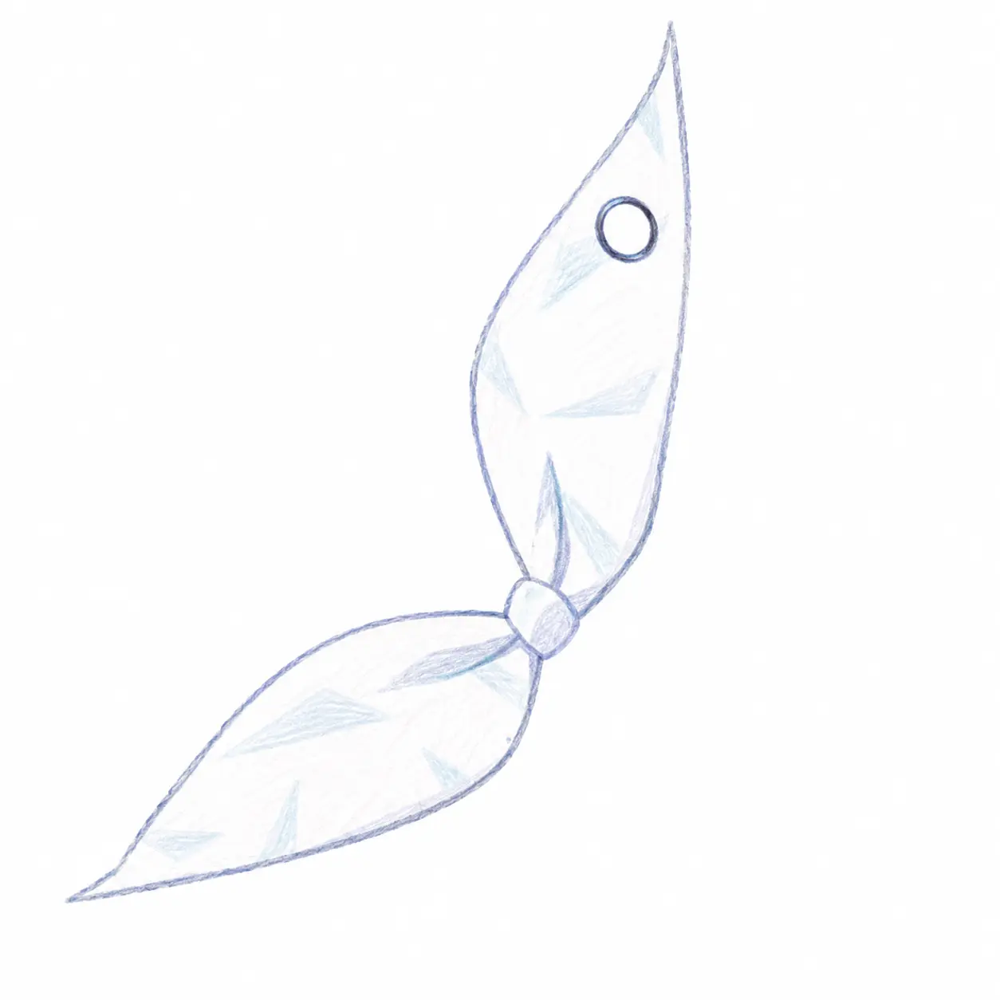

<!-- markdownlint-disable MD033 MD041 MD036 -->

# Plana

**Infrastructure for long-running programs to self-upgrade and balance load**

<!-- markdownlint-enable MD033 MD041 MD036 -->

**[English](https://github.com/celestia-island/docs.celestia.world/blob/master/docs/en/guides/platforms/README-plana.md)** &bull; **[简体中文](https://github.com/celestia-island/docs.celestia.world/blob/master/docs/zhs/guides/platforms/README-plana.md)** &bull; **[繁體中文](https://github.com/celestia-island/docs.celestia.world/blob/master/docs/zht/guides/platforms/README-plana.md)** &bull; **[日本語](https://github.com/celestia-island/docs.celestia.world/blob/master/docs/ja/guides/platforms/README-plana.md)** &bull; **[한국어](https://github.com/celestia-island/docs.celestia.world/blob/master/docs/ko/guides/platforms/README-plana.md)** &bull; **[Français](https://github.com/celestia-island/docs.celestia.world/blob/master/docs/fr/guides/platforms/README-plana.md)** &bull; **[Español](https://github.com/celestia-island/docs.celestia.world/blob/master/docs/es/guides/platforms/README-plana.md)** &bull; **[Русский](https://github.com/celestia-island/docs.celestia.world/blob/master/docs/ru/guides/platforms/README-plana.md)**

> Part of the [celestia-island](https://github.com/celestia-island) ecosystem.

Helps daemons, agents, and servers do zero-downtime self-upgrade and multi-instance load balancing: signal/drain lifecycle, health probes, supervised workers, socket-activation handoff, coordination locks.

## Documentation

Architecture, design, and guides live at [docs.celestia.world/en/plana](https://github.com/celestia-island/docs.celestia.world/tree/master/docs/en).

Source: [plana](https://github.com/celestia-island/plana).
